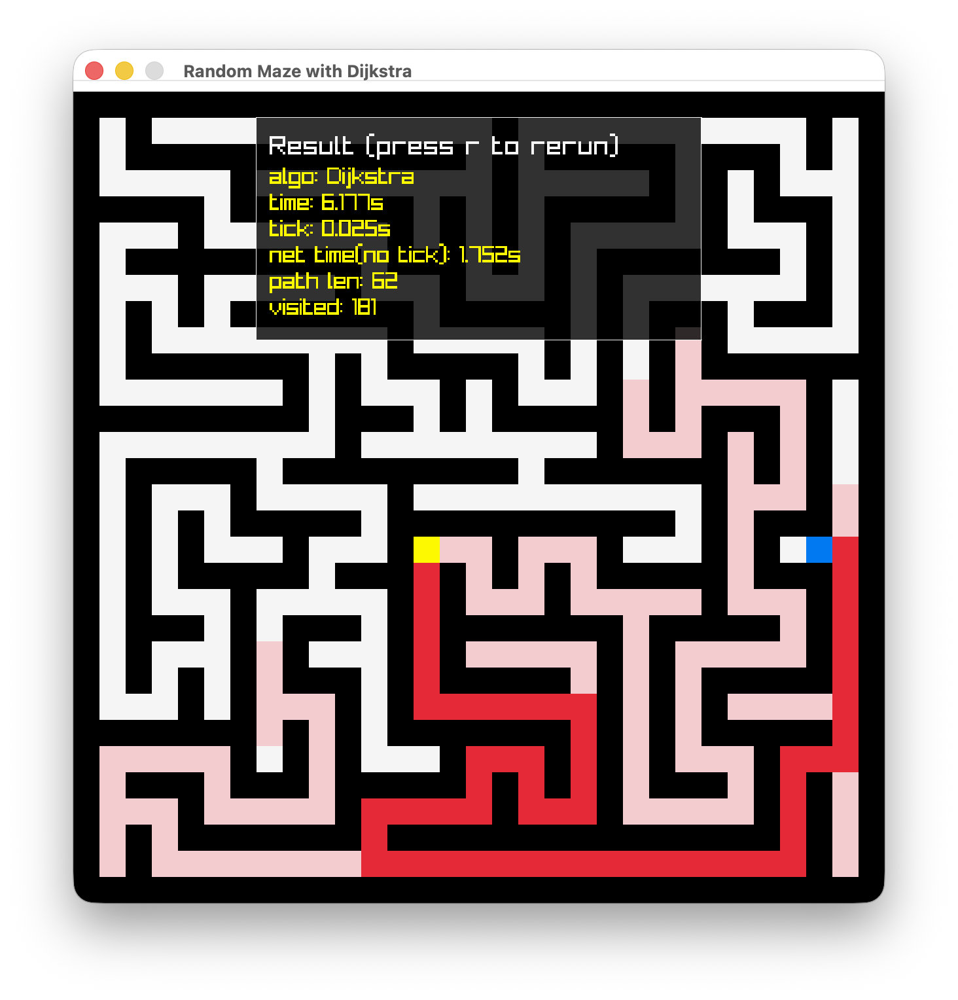
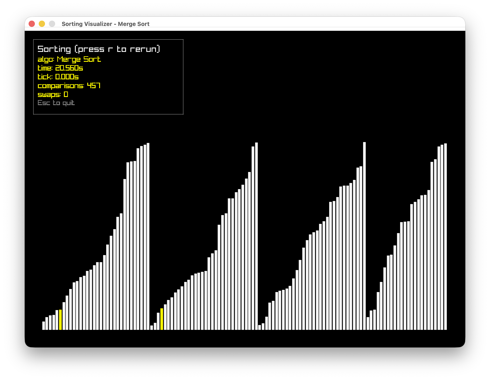

# Maze & Sorting Visualizer

Tiny raylib playground that renders a random maze and visualizes search
algorithms, plus a simple sorting visualizer.

## Requirements

- C compiler 
- [raylib](https://github.com/raysan5/raylib) - Bundled `libs/raylib-5.5_macos/` (no extra install needed)
- [build.h](https://github.com/RaphaeleL/build.h) - Bundled `libs/build.h` (no extra install needed)

## Build

- Compile the builder: `cc build.c -o build`
- Compile the app: `./build`

The helper emits a binary named `main`.

## Run

- Maze search visualizer: `./main maze`
- Sorting visualizer: `./main sort`
- Help: `./main usage`

### Controls

- `Esc` to quit
- `r` to re-generate the maze or reset the sorter

## Switching algorithms

- *Maze search*: edit `maze.h` and swap which header is included under the “Choose one algorithm” section (bfs/dfs/greedy/astar/dijkstra).
- *Sorting*: edit `sort.h` and choose one include under its “Choose one algorithm” section (bubble/selection/merge/quick/heap).

## Example

